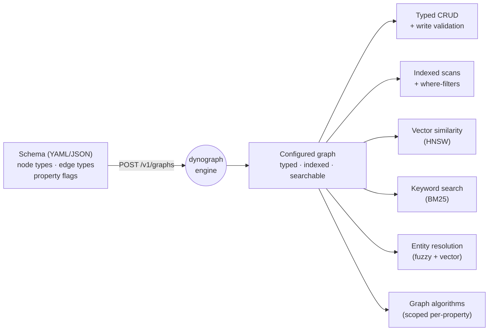
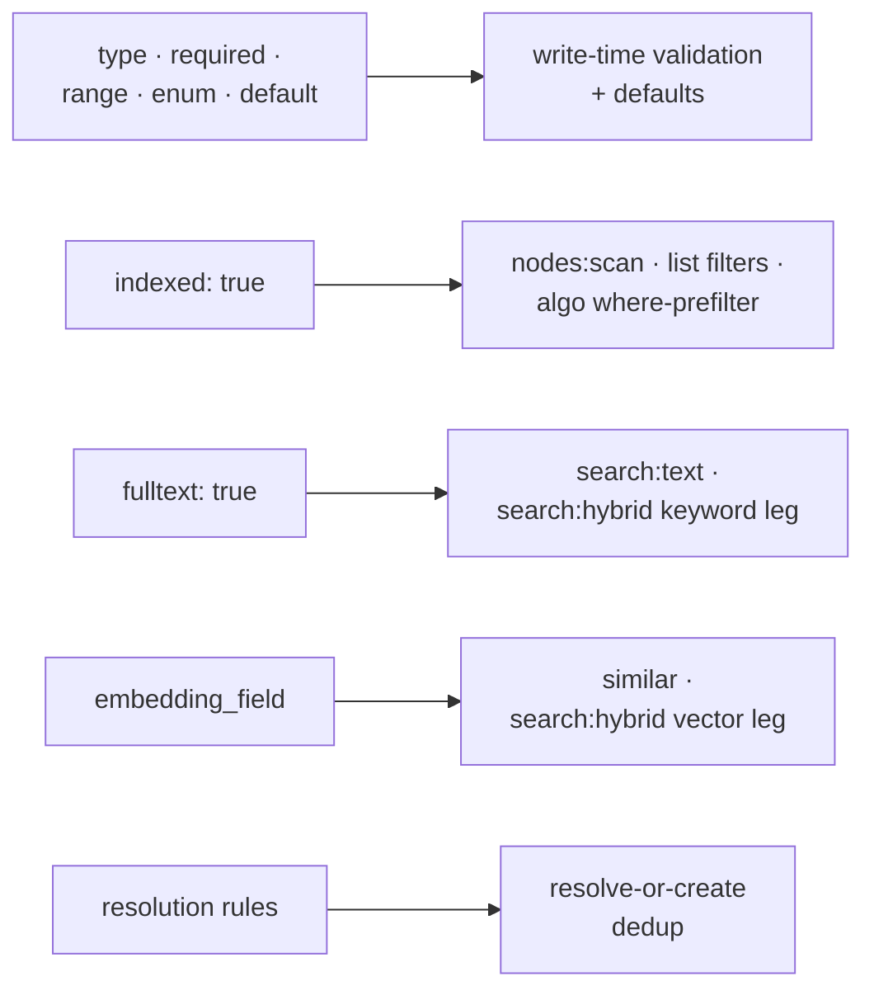
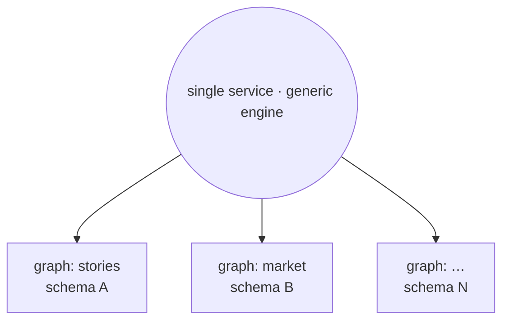

# dynograph-foundation

Rust workspace: schema-driven graph storage on RocksDB, HNSW vector
search, and an HTTP service over both. Usable as embedded library
crates or as the `dynograph` binary.

## Crates

| Crate | Role |
|---|---|
| `dynograph-core` | Schema model (`Schema`, `NodeTypeDef`, `EdgeTypeDef`, `Value`, `DynoError`); YAML/JSON parse + validate. |
| `dynograph-storage` | RocksDB-backed node/edge persistence; sidecar embedding store; atomic batches. |
| `dynograph-resolution` | Three-tier entity resolution: fuzzy → vector tiebreaker → new. |
| `dynograph-vector` | Pure f32/f64 vector + stats math, and the HNSW index. |
| `dynograph-graph` | Pure, dependency-free graph-theory algorithms (centrality, components, communities, paths, flow). |
| `dynograph-game` | Pure, dependency-free normal-form game-theory analysis. |
| `dynograph-text` | Tantivy-backed full-text (BM25) index. |
| `dynograph-service` | axum HTTP service; multi-graph registry; pluggable auth; `/v1/*` REST + `/metrics`. |
| `dynograph-client` | Async `reqwest` client for `/v1/*`. |

No crates are published to crates.io; consume by git tag (below).

### Pluggable storage backends

`dynograph-storage` keeps all the schema-aware logic (validation, indexing,
caching, batching, full-text mirroring) *above* a narrow `KvBackend` trait —
a handful of byte-level operations over named column families. RocksDB is the
production backend and an in-memory map is the test backend, but the engine
itself is backend-agnostic. If you'd rather run on something else — PostgreSQL,
SQLite, sled — it's a matter of implementing that one trait; nothing in the
graph engine has to change.

RocksDB sits behind the **`rocksdb` cargo feature, which is on by default**, so
the shipped binary and library behave exactly as before. Building with
`--no-default-features` drops RocksDB (and its ~10-minute C++ compile),
leaving the in-memory backend alone — handy for fast test/CI builds and for
consumers that don't need on-disk persistence. Such a build fails loud if asked
to use on-disk storage (a set `storage.root`/`DYNOGRAPH_STORAGE_ROOT`) rather
than silently falling back to memory.

## Schema-driven configuration

The pitch in one line: **one generic engine, configured by a schema, becomes a
typed, indexed, searchable graph service — with no code, no migration, and no
redeploy.** You `POST` a schema; the same binary now validates writes, builds
indexes, answers vector/keyword searches, dedups entities, and runs graph
algorithms over *your* node and edge types.



Each declaration in the schema is what *turns on* a capability — the engine has
no hardcoded domain types, only the ones your schema names:



A minimal schema (a `Character` type whose `name` is exact-match indexed and
also full-text searchable, with embeddings drawn from `description`, plus a
`KNOWS` edge):

```yaml
schema:
  name: stories
  version: 1
  node_types:
    Character:
      properties:
        name:        { type: string, required: true, indexed: true, fulltext: true }
        role:        { type: enum, values: [protagonist, antagonist, supporting] }
        story_id:    { type: string, indexed: true }
        description: { type: string }
      embedding_field: description
      resolution: { strategy: fuzzy_then_vector, fuzzy_threshold: 70 }
  edge_types:
    KNOWS:
      from: Character
      to:   Character
```

One service hosts many independent graphs, each with its own schema — so a
single deployment is multi-tenant and turnkey:



Because `story_id` above is an indexed *property* (not a type), the `algo/*`
endpoints can scope analytics to one logical sub-graph (e.g. per-story PageRank)
inside that one shared graph via a `where` predicate.

## Build

```
cargo build --workspace
cargo test  --workspace
```

MSRV 1.94. First build compiles vendored RocksDB (~5–10 min);
incremental rebuilds are sub-second.

## Run the service

The `dynograph` binary lives in `dynograph-service`. Three ways to
run it:

```bash
# pull published image
docker run --rm -p 8080:8080 -v dynograph-data:/data \
    -e DYNOGRAPH_STORAGE_ROOT=/data \
    ghcr.io/sligara7/dynograph-foundation:0.9.4

# native
cargo run --release --bin dynograph -- --config dynograph.example.toml

# build via docker compose (from a checkout)
docker compose up

curl http://localhost:8080/health     # ok
curl http://localhost:8080/ready      # ready
curl http://localhost:8080/metrics    # Prometheus text
curl http://localhost:8080/buildinfo  # JSON: version + git SHA
curl http://localhost:8080/openapi.json  # OpenAPI 3.1 contract
```

### API contract (OpenAPI)

`GET /openapi.json` serves an OpenAPI 3.1 document generated from the
service's handlers and wire types, so it can't drift from the running
code. The same document is committed at
[`docs/openapi.json`](docs/openapi.json) as the reviewed wire contract:
point consumer codegen at it, and a CI test fails if the code changes
the contract without the committed spec being regenerated
(`UPDATE_OPENAPI=1 cargo test -p dynograph-service openapi_spec`). The
spec's `info.version` tracks the crate version, so regenerate it as part
of a release bump.

Published images are tagged per release (`:0.9.4`) plus `:latest`.
The publish workflow (`.github/workflows/release.yml`) runs on every
`v*` git tag push.

CLI: `dynograph [--config <path>]`. Env-var overrides:
`DYNOGRAPH_BIND`, `DYNOGRAPH_STORAGE_ROOT`, `RUST_LOG`. Defaults:
in-memory storage, `127.0.0.1:8080`, `noauth`. See
[`dynograph.example.toml`](dynograph.example.toml).

## Use as a library

Git dependency on the latest tag (`v0.9.4`):

```toml
[dependencies]
dynograph-core    = { git = "https://github.com/sligara7/dynograph-foundation.git", tag = "v0.9.4" }
dynograph-storage = { git = "https://github.com/sligara7/dynograph-foundation.git", tag = "v0.9.4" }
```

```rust
use dynograph_core::Schema;
use dynograph_storage::StorageEngine;

let schema = Schema::from_yaml(include_str!("schema.yaml"))?;
let mut engine = StorageEngine::new_in_memory(schema);
engine.create_node("graph1", "Person", "alice", properties)?;
```

`dynograph-client` against a running service:

```toml
[dependencies]
dynograph-client = { git = "https://github.com/sligara7/dynograph-foundation.git", tag = "v0.9.4" }
```

```rust
let client = dynograph_client::DynographClient::new("http://localhost:8080")
    .with_bearer(jwt_token);
let metadata = client.get_graph("g1").await?;
```

## Docs

- [`docs/endpoints.md`](docs/endpoints.md) — **the complete endpoint catalog** (all 79 `/v1` routes)
- [`docs/openapi.json`](docs/openapi.json) — machine-readable OpenAPI 3 contract
- [`docs/api.md`](docs/api.md) — worked request/response examples for the core CRUD + primitives
- [`docs/service.md`](docs/service.md) — config, deployment, probes
- [`docs/migration.md`](docs/migration.md) — embedded → service
- [`CHANGELOG.md`](CHANGELOG.md) — release notes

## License

MIT — see [LICENSE](LICENSE).
